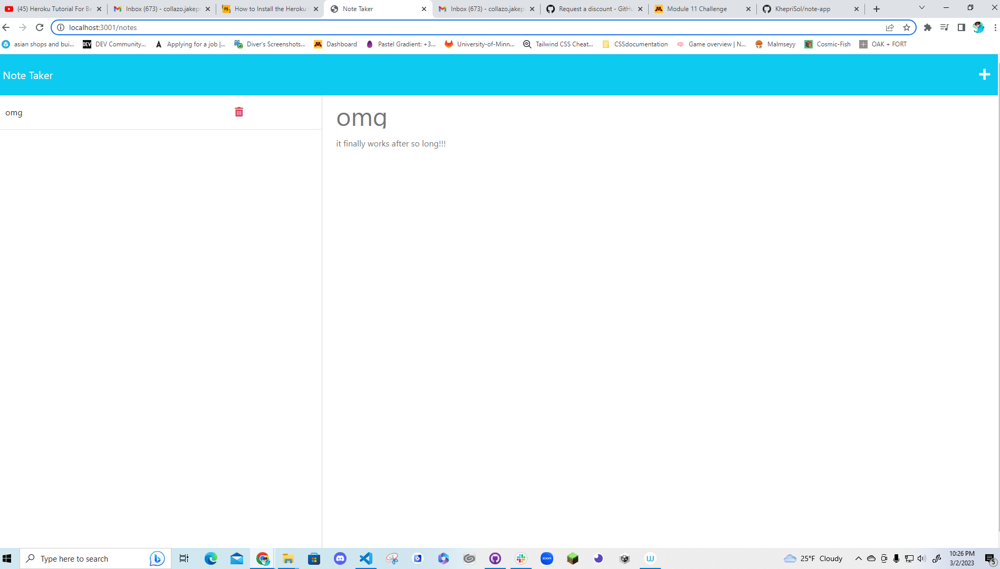

# Note Taker Starter Code

Certainly! Here is an example README file for a project using the code you provided:

# Description
Note Taker is a simple web application that allows users to create and save notes. The application uses a Node.js server and an Express.js application framework to handle HTTP requests and manage the state of the application. Users can view and delete notes, and all notes are persisted to a JSON file on the server.

# Installation
To install the Note Taker application, follow these steps:

Clone the repository to your local machine.
Navigate to the root directory of the application in a terminal or command prompt.
Run npm install to install the necessary dependencies.
# Usage
To use the Note Taker application, follow these steps:

Navigate to the root directory of the application in a terminal or command prompt.
Run npm start to start the server.
Open a web browser and navigate to http://localhost:3001.
Click the "Get Started" button to view the list of notes.
To create a new note, click the pencil icon in the top-right corner of the page. Enter a title and body for the note, then click the save icon.
To view a note, click on the note in the list on the left side of the page.
To delete a note, click the red trash can icon next to the note in the list.